# EvoAuth SDK - Technical Documentation

Welcome to the official documentation for **EvoAuth**, the ultra-fast, enterprise-ready Java Authentication SDK. EvoAuth abstracts the complexity of identity management, allowing you to focus on building your application.

---

##  Architecture Overview

EvoAuth sits between your backend application and the Identity Provider (Auth Server). It manages HTTP communication, token storage, and automatic session recovery.

```mermaid
sequenceDiagram
    participant App as Your Java Application
    participant SDK as EvoAuth SDK
    participant Auth as Auth Server (Cloud/Self-hosted)

    App->>SDK: login(email, password)
    SDK->>Auth: POST /api/v1/auth/login
    Auth-->>SDK: 200 OK (JWT + Refresh Token)
    SDK->>SDK: Store tokens in InMemoryTokenStore
    SDK-->>App: User Object

    Note over App,Auth: Direct API Call (e.g., enableMfa)
    App->>SDK: enableMfa()
    SDK->>Auth: POST /api/v1/2fa/enable (with Header: Bearer <token>)
    Auth-->>SDK: 200 OK
    SDK-->>App: MfaResponse
```



---

##  Getting Started

### 1. Prerequisites
- Java 17 or higher
- Maven 3.6+
- Access to an EvoAuth compatible Auth Server

### 2. Add Dependency
Add this to your `pom.xml`:

```xml
<dependency>
    <groupId>io.github.dakshdubey</groupId>
    <artifactId>evo-auth-sdk</artifactId>
    <version>1.0.6</version>
</dependency>
```

### 3. Basic Configuration & Setup
To use the SDK, first import the required classes:

```java
import com.evoauth.core.AuthClient;
import com.evoauth.core.AuthConfig;
import com.evoauth.models.User;
```

Initialize the `AuthClient` using the fluent Builder pattern:

```java
AuthConfig config = new AuthConfig.Builder()
    .baseUrl("https://auth.example.com")
    .apiKey("your-tenant-api-key")
    .connectionTimeoutMs(5000)
    .build();

AuthClient auth = new AuthClient(config);
```

---

##  Core Functionalities

### Authentication Flow
```java
// User Signup
User newUser = auth.signup("test@example.com", "secret123", "John", "Doe");

// User Login
User user = auth.login("test@example.com", "secret123");

// Checks
if (auth.isAuthenticated()) {
    System.out.println("Hello, " + auth.getCurrentUser().getFirstName());
}

// Logout (Clears local session and notifies server)
auth.logout();
```

### Automatic Token Refresh (Zero-Config)
One of EvoAuth's most powerful features is **Automatic Interception**. If a request fails with a `401 Unauthorized` status (due to an expired Access Token), the SDK will:
1. Pause the request.
2. Silently use the **Refresh Token** to get a new Access Token.
3. Update the internal session.
4. Retry the original request with the new token.

> [!NOTE]
> This happens entirely in the background. Your application code doesn't need to handle "Expired Token" exceptions for standard SDK calls.

---

##  OAuth2 & Social Login

EvoAuth supports seamless integration with social providers.

### Step 1: Generate Redirect URL
```java
String loginUrl = auth.getSocialLoginUrl(OAuthProvider.GOOGLE, "https://yourapp.com/callback");
// Redirect your user to loginUrl
```

### Step 2: Handle Callback
When the user returns to your callback URL with a `code`:
```java
User user = auth.handleSocialCallback(code);
```

---

##  Spring Boot Integration

If you are using Spring Boot, use our **Starter** for zero-boilerplate setup.

### 1. Register properties in `application.yml`
```yaml
evo:
  auth:
    base-url: http://localhost:9090
    api-key: my-secret-key
```

### 2. Inject and Use
```java
@Service
public class MyService {
    @Autowired
    private AuthClient auth;

    public void process() {
        // SDK is already configured and ready to use
    }
}
```

---

##  Role-Based Access Control (RBAC)

Use the `PermissionGuard` utility to protect sensitive logic:

```java
User user = auth.getCurrentUser();

if (PermissionGuard.hasRole(user, "ADMIN")) {
    // Perform admin operation
}

PermissionGuard.checkRole(user, "USER"); // Throws exception if missing
```

---

##  Advanced Configuration

| Property | Default | Description |
|----------|---------|-------------|
| `baseUrl` | Required | The endpoint of your Auth Server |
| `apiKey` | Required | Tenant specific API key |
| `connectionTimeout` | 10,000ms | Timeout for network calls |

---

##  License
This SDK is distributed under the MIT License.
